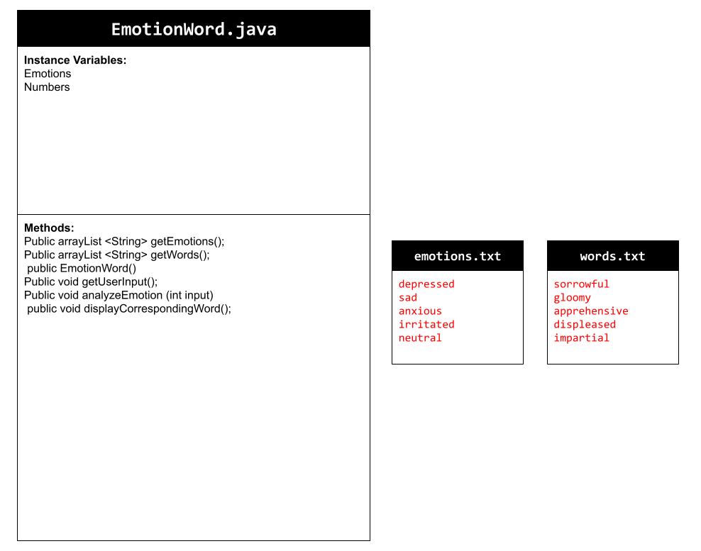

# Natural-language-processing-project
# Unit 6 - Natural Language Processing Project

## Introduction

Natural language processing (NLP) is used in many apps and devices to interact with users and make meaning of text to determine how to respond, find information, or to create new text. Your goal is to use natural language processing techniques to identify structure, patterns, and meaning in a text to have conversations with a user, execute commands, perform manipulations on the text, or generate new text.

## Requirements

Use your knowledge of object-oriented programming, ArrayLists, the String class, and algorithms to create a program that uses natural language processing techniques:

- **Create at least two ArrayLists** – Create at least two ArrayLists to store the data used in your program, such as data from text files or entered by the user.
- **Implement one or more algorithms** – Implement one or more algorithms that use loops and conditionals to find or manipulate elements in an ArrayList or String object.
- **Use methods in the String class** - Use one or more methods in the String class in your program, such as to divide text into sentences or phrases.
- **Use at least one natural language processing technique** – Use a natural language processing technique to process, analyze, and/or generate text.
- **Document your code** – Use comments to explain the purpose of the methods and code segments and note any preconditions and postconditions.

## UML Diagram

Put an image of your UML Diagram here. Upload the image of your UML Diagram to your repository, then use the Markdown syntax to insert your image here. Make sure your image file name is one word, otherwise it might not properly get displayed on this README.

## Video

Record a short video of your project to display here on your README. You can do this by:

- Screen record your project running on Code.org.
- Upload that recording to YouTube.
- Take a thumbnail for your image.
- Upload the thumbnail image to your repo.
- Use the following markdown code:

)

## Project Description

Our project's goal was to have the user receive the emotion and corresponding word they feel based on a number they input 1-10; 1 being most gloomy and 10 being extremely happy. This can help to interpret human emotions based on an easy scale they are given. We used a list of 10 emotions and a list of 10 words, with each word corresponding to each emotion being inputted. The user is asked the question,”How are you feeling (1-10)?” with an emotion next to each number, The user then inputs a number based on their current emotion, resulting in the output “You are feeling: EMOTION”. And “The corresponding word is: WORD”. Through ArrayLists, Strings, and an If else statement, we were able to match each emotion to a word and make sure the user gets an accurate response based on the number they input.

## NLP Techniques

We implemented a synonym replacement NLP in order for our program to be able to ask a question to the user about the type of emotion they feel and returning a word synonymous to that emotion and displaying both. The methods in our project that are associated with this are the getUserInput and analyzeEmotion. The getUserInput method asks two questions. It first displays in the console log to select an emotion by its number and then gets the index of the emotions and displays all 10 from the list. The next question asks the user to input a number 1-10 of an emotion that correlates with how they feel, but if they choose a number not on the list it will return it is not a valid number in the list. When they input a number from the list, it will then call the analyzeEmotion method. This method will subtract the index by one because indexes start at 0 which makes it display the emotion they feel and then the word synonymous with that emotion and makes it all uppercase to highlight the choice the user makes. 

